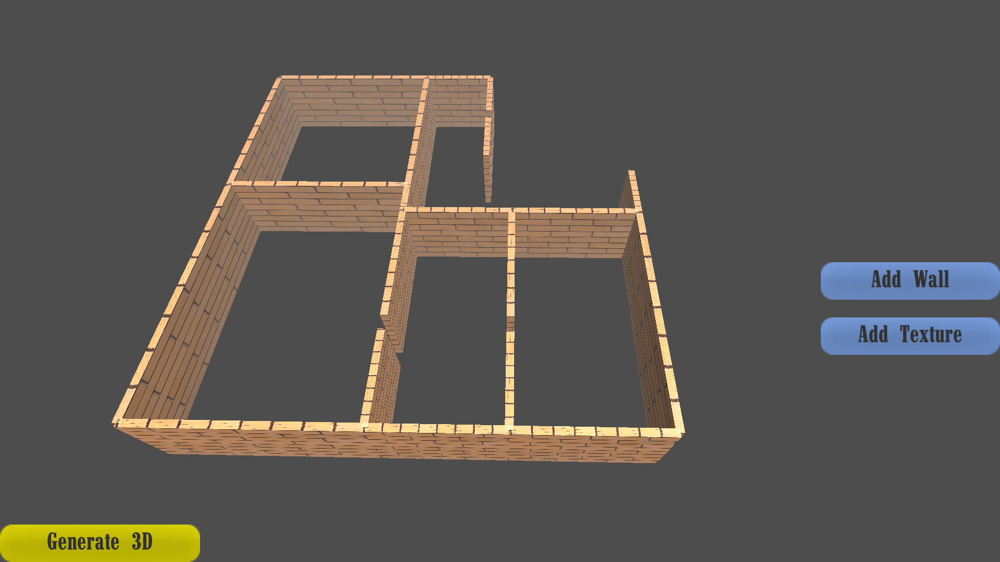

# BUILDING INFORMATION MODELING-AUTOMATION OF 3D RECONSTRUCTION 
[colab](https://colab.research.google.com/drive/1BzDPxoMdxujfr4oa-GpBeUyM53HRl3Uf)
[Research Papers](https://drive.google.com/drive/folders/158C8WPONIfeXPt0sR6XoaGPvizsOnsXt?usp=sharing)
[Data Set](https://drive.google.com/drive/folders/1zPIkAuGwncZM1ecHdysdUZiOIh6G8IRE?usp=sharing)
[Documentation](https://drive.google.com/file/d/17u8FXMH2QopidDlX4GRNMXg5nYBjgb6X/view?usp=sharing)

This project introduces a method for auto-conversion of 2D floor plans into the 3D graphical representation. Architectural floor plan plays a crucial role in designing, understanding, or remodeling indoor spaces and effective in conveying geometric and semantic information of a scene. Professional architects or designers draw floor plans in a vector-graphics representation using software such as AutoCAD, 3D max etc.
2D floor plans are collected in raster format and used as a dataset. These drawings are then semantically segmented by using object detection framework Yolo-V3. We use junction points as an object and detect them by using deep learning. A neural architecture transforms a 2D image into a set of junction points that shows low level semantic information. 
Detected junction points mapped into a hierarchy of walls and doors to build a graphical representation of 2D image. A low-level hierarchy are then transformed into 3D by using a geometric processing method. For better performance we design an algorithm to handle the wrongly and unpredicted junction points. Lastly, a web application is introduced to allow any user to obtain a 3D model with ease. 
To conclude, this project has proposed an automated process for reconstruction and made it ready to use even for a person without technical knowledge.


### Demo of the project
<p align="center"></p>

### Project's url
https://bim-utcmp7cfha-uc.a.run.app/


There is problem with google cloud and currently the machine learning is not working there. You can clone this repo and follow the instructions for running this project in your machine


If there is a custom function you want to see created then create an issue in the issues tab and suggest it! If enough people suggest the same custom function I will add it quickly!

## Getting Started
### Installation Guides

I am demonstrating how you can run this project on the machine (Linux ubuntu recommended). For testing purpose, there is no need for gpu. You can run this project without gpu. I am using linux ubuntu, you can follow youe own steps if you want to run in windows. You can run this project in google colab as well by following same instructions

### Cloning the Darknet
```bash
#Python == 3.8 (required)
#pip3          (required)

# Clone the darknet from AlexyAB
https://github.com/AlexeyAB/darknet 

```

### Pip (Reuirements)

```bash

# Opencv python (Only openCV is required)
pip3 install python-opencv

```
### Change the Configuration files

Open the Makefile in the darknet folder and change the openCV to 1 
Make file configuration file look like this remaining will unchange
```bash

  GPU=0
  CUDNN=0
  CUDNN_HALF=0
  OPENCV=1 (change this line only)
  AVX=0
  OPENMP=1
  LIBSO=0
  ZED_CAMERA=0
  ZED_CAMERA_v2_8=0
```


```bash

#Download our pre-trained weights and save these weights in the darknet folder
https://drive.google.com/file/d/1nUfl4oCJ58g5J9qE2llIBQ7Kgox3DSDl/view?usp=sharing

#Download the image_data.data and classes.names and save in the data folder (./darknet/data)

#image_data.data file
https://drive.google.com/file/d/1dYrjtl_mrFfBonpJ8mlFTht6BYNxdnAd/view?usp=sharing

#class.names file 
https://drive.google.com/file/d/1dXplE-EhbjPqhT82gU-oqUFOjzk7TOe2/view?usp=sharing

#Downlaod our cfg (configiration file ) and save in cfg folder in darkent (./darknet/cfg)
https://drive.google.com/file/d/1--vYDvlr5fdivipd4XI56FD9xKU2iaSx/view?usp=sharing

#Downalod image.c file and replace in src directory (dimage.c file that contain in darknet folder contains error you have to resolve it manually if you are not using our image.c file, furter we add our algorthm that improves its accuracy and return the bounding boxes as well) (./darknet/src)
https://drive.google.com/file/d/1-Fc1oFa-0zz4t1V3pUKO917XzNGYvXEZ/view?usp=sharing

#Add the test image at the darknet folder and name it data.jpg (./darknet/data.jpg)
#you can download test image from test_images from folder from repo

```
The folder structure look like this after you download all the files and place it on its place as describe.

```bash

  darknet
    |
    ---> yolov3_custom2_last.weights
    |
    -->src
    |   |
    |    -->image.c
    |
    -->data
    |   |
    |   -->image_data.data
    |   |
    |   -->classes.names
    |
    |
    -->cfg
    |    |
    |   -->yolov3_custom2.cfg
    |
    -->data.jpg

```
## Run the detector 
```bash

#Open the terminal at the darknet folder and run the following command
./darknet detector test data/image_data.data cfg/yolov3_custom2.cfg yolov3_custom2_last.weights data.jpg -thresh 0.15

```
After running this line the model will generate data.txt file that contains the points for rendering purpose. if you don't want these points you can edit image.c file in darknet/src/image.c file to edit. you can get the predicted points at the image.c file.

## Web application 


<p align="center"></p>

<p align="center"></p>

<p align="center"></p>

<p align="center"></p>

<p align="center"></p>

<p align="center"></p>

<p align="center"></p> 

<p align="center"></p> 


Follow the instruction if you want to run flask application in your machine. you can upload image there and detector will run automatically and its render into 3D as well at run time.

### Pip (requirements for web application)

```bash

#flask
pip3 install flask

#flask-cors
pip3 install flask-cors

```

## Clone this repository to get flask app

Clone this repository same where you cloned the darknet folder the folder strcutre will be look like this

```bash

  your_folder
    |
    ---> darknet
    |
    -->flask (this repository)

```

### Run thie flask-app

```bash

#Open your_project in cmd and run the following command, the flask app will run automatically (before running flask app make sure your darknet is working properly)

python ./flask/server/src/app.py
  
  #follow any one of the the instruction

#or you run project with your sturcuture but you have to chnage the folder path in ./flask/server/app.py file
os.chdir('./darknet') change this line to your darknet folder path

```
now the app will run on your local server at http://127.0.0.1:5000/

## Project Documentation  
For detailed information about the project, you can read our documentation 
https://drive.google.com/file/d/17u8FXMH2QopidDlX4GRNMXg5nYBjgb6X/view?usp=sharing

## Contributers 

We are welcome our collabraters clone thie project and create pull requests for further deployments

## Contact us 

email us for any help : hamzaasif0987@gmail.com
